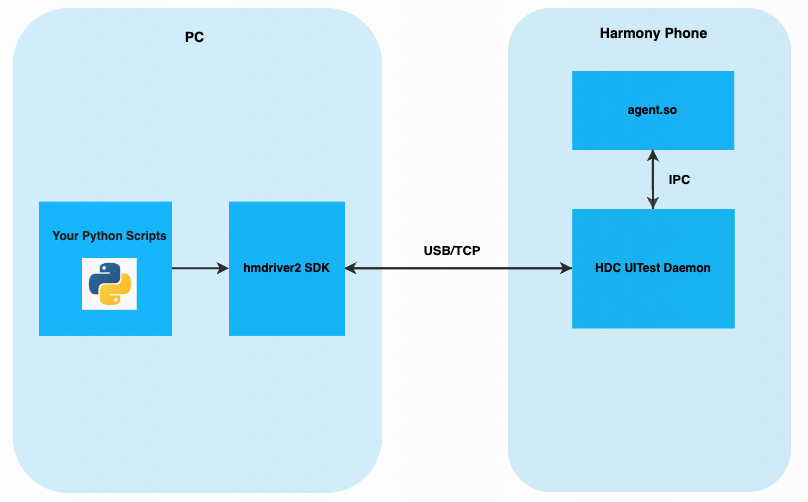

# hmdriver2
[](https://github.com/codematrixer/hmdriver2/actions)
[](https://pypi.python.org/pypi/hmdriver2)

[](https://pepy.tech/project/hmdriver2)


>写这个项目前github上已有个[hmdirver](https://github.com/mrx1203/hmdriver)，但它是侵入式（需要提前在手机端安装一个testRunner app）。另外鸿蒙官方提供的hypium自动化框架，使用较为复杂，依赖繁杂。于是决定重写一套。


`hmdriver2`是一款支持`HarmonyOS NEXT`系统的UI自动化框架，**无侵入式**，提供应用管理，UI操作，元素定位等功能，轻量高效，上手简单，快速实现鸿蒙应用自动化测试需求。



# Key idea
- **无侵入式**
  - 无需提前在手机端安装testRunner APP（类似atx app）
- **易上手**
  - 在PC端编写Python脚本实现自动化
  - 对齐Android端 [uiautomator2](https://github.com/openatx/uiautomator2) 的脚本编写姿势
- **轻量高效**
  - 摒弃复杂依赖（几乎0依赖），即插即用
  - 操作响应快，低延时

# Feature
- 支持应用管理
  - 应用启动，停止
  - 应用安装，卸载
  - 应用数据清理
  - 获取应用列表，应用详情等
- 支持设备操作
  - 获取设备信息，分辨率，旋转状态等
  - 屏幕解锁，亮屏，息屏
  - Key Events
  - 文件操作
  - 屏幕截图
  - 屏幕录屏
  - 手势操作（点击，滑动，输入，复杂手势）
- 支持控件操作
  - 控件查找（联合查找，模糊查找，相对查找）
  - 控件信息获取
  - 控件点击，长按，拖拽，缩放
  - 文本输入，清除
  - 获取控件树
- 支持Toast获取
- [TODO] 全场景弹窗处理
- [TODO] 操作标记
- [TODO] Inspector


# QUICK START
   
1. 配置鸿蒙`HDC`环境
   1. 下载 [Command Line Tools](https://developer.huawei.com/consumer/cn/download/) 并解压
   2. `hdc`文件在`command-line-tools/sdk/HarmonyOS-NEXT-DB2/openharmony/toolchains`目录下
   3. 配置环境变量，macOS为例，在~/.bash_profile 或者 ~/.zshrc文件中添加
```bash
export HM_SDK_HOME="/Users/develop/command-line-tools/sdk/HarmonyOS-NEXT-DB2"  //请以sdk实际安装目录为准
export PATH=$PATH:$HM_SDK_HOME/hms/toolchains:$HM_SDK_HOME/openharmony/toolchains
export HDC_SERVER_PORT=7035
```

2. 电脑插上手机，开启USB调试，确保执行`hdc list targets` 可以看到设备序列号


3. 安装`hmdirver2` 基础库
```bash
pip3 install -U hmdriver2
```
如果需要使用[屏幕录屏](#屏幕录屏) 功能，则需要安装额外依赖`opencv-python`
```bash
pip3 install -U "hmdriver2[opencv-python]"
//由于`opencv-python`比较大，因此没有写入到主依赖中
```


4. 接下来就可以愉快的进行脚本开发了 😊😊
```python
from hmdriver2.driver import Driver

d = Driver("FMR0223C13000649")  # 替换成你的serial

print(d.device_info)
# ouput: DeviceInfo(productName='HUAWEI Mate 60 Pro', model='ALN-AL00', sdkVersion='12', sysVersion='ALN-AL00 5.0.0.60(SP12DEVC00E61R4P9log)', cpuAbi='arm64-v8a', wlanIp='172.31.125.111', displaySize=(1260, 2720), displayRotation=<DisplayRotation.ROTATION_0: 0>)

d.start_app("com.kuaishou.hmapp", "EntryAbility")
d(text="精选").click()
d.swipe(0.5, 0.8, 0.5, 0.4)
...
```


---

# API Documents

## 初始化Driver
```python
from hmdriver2.driver import Driver

d = Driver("FMR0223C13000649")
```

参数`serial` 通过`hdc list targets` 命令获取

初始化driver后，下面所有的操作都是调用dirver实现

## App管理
### 安装App
```python
d.install_app("/Users/develop/harmony_prj/demo.hap")
```

### 卸载App
```python
d.uninstall_app("com.kuaishou.hmapp")
```
传入的参数是`package_name`，可通过hdc命令获取`hdc shell bm dump -a`

### 启动App

```python
d.start_app("com.kuaishou.hmapp", "EntryAbility")
```
传入的两个参数分别是`package_name`, `page_name`，可以通过hdc命令获取`hdc shell aa dump -l`


### 停止App
```python
d.stop_app("com.kuaishou.hmapp")
```


### 清除App数据
```python
d.clear_app("com.kuaishou.hmapp")
```
该方法表示清除App数据和缓存

### 获取App详情
```python
d.get_app_info("com.kuaishou.hmapp")
```
输出的数据结构是Dict, 内容如下
```bash
{
    "appId": "com.kuaishou.hmapp_BIS88rItfUAk+V9Y4WZp2HgIZ/JeOgvEBkwgB/YyrKiwrWhje9Xn2F6Q7WKFVM22RdIR4vFsG14A7ombgQmIIxU=",
    "appIdentifier": "5765880207853819885",
    "applicationInfo": {
        ...
        "bundleName": "com.kuaishou.hmapp",
        "codePath": "/data/app/el1/bundle/public/com.kuaishou.hmapp",
        "compileSdkType": "HarmonyOS",
        "compileSdkVersion": "4.1.0.73",
        "cpuAbi": "arm64-v8a",
        "deviceId": "PHONE-001",
				...
        "vendor": "快手",
        "versionCode": 999999,
        "versionName": "12.2.40"
    },
    "compatibleVersion": 40100011,
    "cpuAbi": "",
    "hapModuleInfos": [
        ...
    ],
    "reqPermissions": [
        "ohos.permission.ACCELEROMETER",
        "ohos.permission.GET_NETWORK_INFO",
        "ohos.permission.GET_WIFI_INFO",
        "ohos.permission.INTERNET",
        ...
    ],
		...
    "vendor": "快手",
    "versionCode": 999999,
    "versionName": "12.2.40"
}
```


## 设备操作
### 获取设备信息
```python
from hmdriver2.proto import DeviceInfo

info: DeviceInfo = d.device_info
```
输入内容如下
```bash
DeviceInfo(productName='HUAWEI Mate 60 Pro', model='ALN-AL00', sdkVersion='12', sysVersion='ALN-AL00 5.0.0.60(SP12DEVC00E61R4P9log)', cpuAbi='arm64-v8a', wlanIp='172.31.125.111', displaySize=(1260, 2720), displayRotation=<DisplayRotation.ROTATION_0: 0>)
```
然后就可以获取你想要的值, 比如
```python
info.productName
info.model
info.wlanIp
info.sdkVersion
info.sysVersion
info.cpuAbi
info.displaySize
info.displayRotation
```

### 获取设备分辨率
```python
w, h = d.display_size

# outout: (1260, 2720)
```

### 获取设备旋转状态
```python
from hmdriver2.proto import DisplayRotation

rotation = d.display_rotation
# ouput: DisplayRotation.ROTATION_0
```

设备旋转状态包括：
```python
ROTATION_0 = 0    # 未旋转
ROTATION_90 = 1  # 顺时针旋转90度
ROTATION_180 = 2  # 顺时针旋转180度
ROTATION_270 = 3  # 顺时针旋转270度
```

### 设置设备旋转
```python
from hmdriver2.proto import DisplayRotation

# 旋转180度
d.set_display_rotation(DisplayRotation.ROTATION_180)
```


### Home
```python
d.go_home()
```
### 返回
```python
d.go_back()
```
### 亮屏
```python
d.screen_on()
```

### 息屏
```python
d.screen_off()
```

### 屏幕解锁
```python
d.unlock()
```

### Key Events
```python
from hmdriver2.proto import KeyCode

d.press_key(KeyCode.POWER)
```
详细的Key code请参考 [harmony key code](https://github.com/codematrixer/hmdriver2/blob/4d7bceaded947bd63d737de180064679ad4c77b8/hmdriver2/proto.py#L133)


### 执行hdc
```python
data = d.shell("ls -l /data/local/tmp")

print(data.output)
```
这个方法等价于执行  `hdc shell ls -l /data/local/tmp`

Notes: `HDC`详细的命令解释参考：[awesome-hdc](https://github.com/codematrixer/awesome-hdc)


### 打开URL (schema)
```python
d.open_url("http://www.baidu.com")

d.open_url("kwai://myprofile")

```


### 文件操作
```python
# 将手机端文件下载到本地电脑
d.pull_file(rpath, lpath)

# 将本地电脑文件推送到手机端
d.push_file(lpath, rpath)
```
参数`rpath`表示手机端文件路径，`lpath`表示本地电脑文件路径


### 屏幕截图
```python
d.screenshot(path)

```
参数`path`表示截图保存在本地电脑的文件路径

### 屏幕录屏
方式一
```python
# 开启录屏
d.screenrecord.start("test.mp4")

# do somethings
time.sleep(5)

# 结束录屏
d.screenrecord.stop()
```
上述方式如果录屏过程中，脚本出现异常时，`stop`无法被调用，导致资源泄漏，需要加上try catch

【推荐】方式二  ⭐️⭐️⭐️⭐️⭐️
```python
with d.screenrecord.start("test2.mp4"):
    # do somethings
    time.sleep(5)
```
通过上下文语法，在录屏结束时框架会自动调用`stop` 清理资源

Notes: 使用屏幕录屏需要依赖`opencv-python`
```bash
pip3 install -U "hmdriver[opencv-python]"
```

### Device Touch
#### 单击
```python
d.click(x, y)

# eg.
d.click(200, 300)
d.click(0.4, 0.6)
```
参数`x`, `y`表示点击的坐标，可以为绝对坐标值，也可以为相当坐标（屏幕百分比）

#### 双击
```python
d.double_click(x, y)

# eg.
d.double_click(500, 1000)
d.double_click(0.5, 0.4)
```
#### 长按
```python
d.long_click(x, y)

# eg.
d.long_click(500, 1000)
d.long_click(0.5, 0.4)
```
#### 滑动
```python
d.swipe(x1, y1, x2, y2, spped)

# eg.
d.swipe(600, 2600, 600, 1200, speed=2000)  # 上滑
d.swipe(0.5, 0.8, 0.5, 0.4, speed=2000)
```
参数`x1`, `y1`表示滑动的起始点，`x2`, `y2`表示滑动的终点，`speed`为滑动速率, 范围:200~40000, 不在范围内设为默认值为2000, 单位: 像素点/秒

#### 输入
```python
d.input_text(text)

# eg.
d.input_text("adbcdfg")
```
参数`x`, `y`表示输入的位置，`text`表示输入的文本


#### 复杂手势
复杂手势就是手指按下`start`，移动`move`，暂停`pause`的集合，最后运行`action`

```python
g = d.gesture

g.start(x1, y1, interval=0.5)
g.move(x2, y2)
g.pause(interval=1)
g.move(x3, y3)
g.action()
```
也支持链式调用（推荐）
```python
d.gesture.start(x1, y1, interval=.5).move(x2, y2).pause(interval=1).move(x3, y3).action()
```

参数`x`, `y`表示坐标位置，可以为绝对坐标值，也可以为相当坐标（屏幕百分比），`interval`表示手势持续的时间，单位秒。

如果只有start手势，则等价于点击：
```python
d.gesture.start(x, y).action() # click

# 等价于
d.click(x, y)
```

*如下是一个复杂手势的效果展示*


## 控件操作

### 控件选择器
控件查找支持这些`by`属性
- `id`
- `key`
- `text`
- `type`
- `description`
- `clickable`
- `longClickable`
- `scrollable`
- `enabled`
- `focused`
- `selected`
- `checked`
- `checkable`
- `isBefore`
- `isAfter`


**普通定位**
```python
d(text="tab_recrod")

d(id="drag")

# 定位所有`type`为Button的元素，选中第0个
d(type="Button", index=0)
```
Notes：当同一界面有多个属性相同的元素时，`index`属性非常实用

**模糊定位TODO**

**组合定位**

指定多个`by`属性进行元素定位
```python
# 定位`type`为Button且`text`为tab_recrod的元素
d(type="Button", text="tab_recrod")
```

**相对定位**
```python
# 定位`text`为showToast的元素的前面一个元素
d(text="showToast", isAfter=True) 

# 定位`id`为drag的元素的后面一个元素
d(id="drag", isBefore=True)
``` 

### 控件查找
结合上面讲的控件选择器，就可以进行元素的查找
```python
d(text="tab_recrod").exists()
d(type="Button", text="tab_recrod").exists()
d(text="tab_recrod", isAfter=True).exists()

# 返回 True or False

d(text="tab_recrod").find_component()
# 当没找到返回None
```

### 控件信息

```python
d(text="tab_recrod").info

# output:
{
    "id": "",
    "key": "",
    "type": "Button",
    "text": "tab_recrod",
    "description": "",
    "isSelected": False,
    "isChecked": False,
    "isEnabled": True,
    "isFocused": False,
    "isCheckable": False,
    "isClickable": True,
    "isLongClickable": False,
    "isScrollable": False,
    "bounds": {
        "left": 539,
        "top": 1282,
        "right": 832,
        "bottom": 1412
    },
    "boundsCenter": {
        "x": 685,
        "y": 1347
    }
}
```
也可以单独调用对应的属性

```python
d(text="tab_recrod").id
d(text="tab_recrod").key
d(text="tab_recrod").type
d(text="tab_recrod").text
d(text="tab_recrod").description
d(text="tab_recrod").isSelected
d(text="tab_recrod").isChecked
d(text="tab_recrod").isEnabled
d(text="tab_recrod").isFocused
d(text="tab_recrod").isCheckable
d(text="tab_recrod").isClickable
d(text="tab_recrod").isLongClickable
d(text="tab_recrod").isScrollable
d(text="tab_recrod").bounds
d(text="tab_recrod").boundsCenter
```


### 控件数量
```python
d(type="Button").count   # 输出当前页面`type`为Button的元素数量

# 也可以这样写
len(d(type="Button"))
```


### 控件点击
```python
d(text="tab_recrod").click()
d(type="Button", text="tab_recrod").click()

d(text="tab_recrod").click_if_exists() 

```
以上两个方法有一定的区别
- `click` 如果元素没找到，会报错`ElementNotFoundError`
- `click_if_exists` 即使元素没有找到，也不会报错，相当于跳过

### 控件双击
```python
d(text="tab_recrod").double_click()
d(type="Button", text="tab_recrod").double_click()
```

### 控件长按
```python
d(text="tab_recrod").long_click()
d(type="Button", text="tab_recrod").long_click()
```


### 控件拖拽
```python
from hmdriver2.proto import ComponentData

componentB: ComponentData = d(type="ListItem", index=1).find_component()

# 将元素拖动到元素B上
d(type="ListItem").drag_to(componentB)

```
`drag_to`的参数`component`为`ComponentData`类型

### 控件缩放
```python
# 将元素按指定的比例进行捏合缩小1倍
d(text="tab_recrod").pinch_in(scale=0.5)

# 将元素按指定的比例进行捏合放大2倍
d(text="tab_recrod").pinch_out(scale=2)
```
其中`scale`参数为放大和缩小比例


### 控件输入
```python
d(text="tab_recrod").input_text("abc")
```

### 文本清除
```python
d(text="tab_recrod").clear_text()
```


## 获取控件树
```python
d.dump_hierarchy()
```
输出控件树格式参考 [hierarchy.json](/docs/hierarchy.json)


## 获取Toast
```python
# 启动toast监控
d.toast_watcher.start()

# do something 比如触发toast的操作
d(text="xx").click()  

# 获取toast
toast = d.toast_watcher.get_toast()

# output: 'testMessage'
```


# 鸿蒙Uitest协议

See [DEVELOP.md](/docs/DEVELOP.md)


# 拓展阅读
[hmdriver2 发布：开启鸿蒙 NEXT 自动化新时代](https://testerhome.com/topics/40667)


# Contributors
[Contributors](https://github.com/codematrixer/hmdriver2/graphs/contributors)


# Reference

- https://developer.huawei.com/consumer/cn/doc/harmonyos-guides-V5/ut-V5
- https://github.com/codematrixer/awesome-hdc
- https://github.com/openatx/uiautomator2
- https://github.com/mrx1203/hmdriver